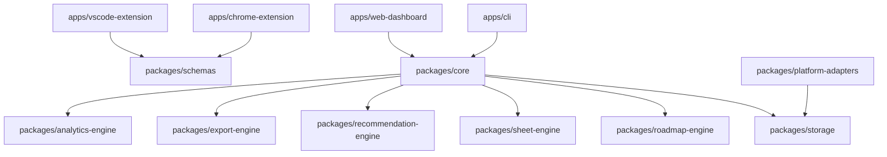

# Architecture

CP Forge is a local-first monorepo. Apps are thin surfaces over typed packages.

## Local-First Contract

The `.cpforge/` workspace is the source of truth for the CLI. Browser data lives in browser-local stores. Exports are explicit files, not uploads.

## Adapter Isolation

Platform integrations are isolated in `packages/platform-adapters`. Codeforces API sync is stable and public. LeetCode network behavior is optional and must fail gracefully.
